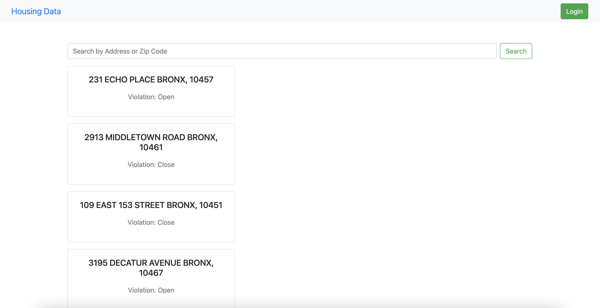
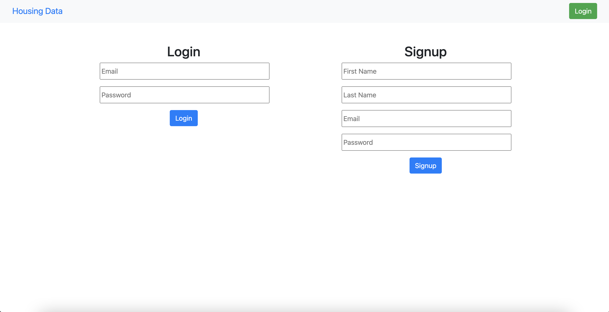
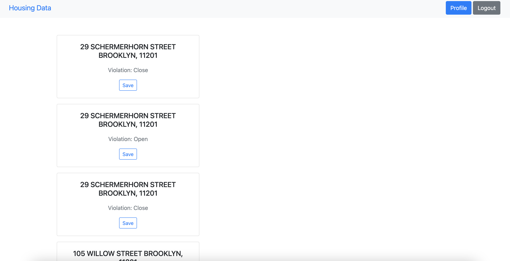
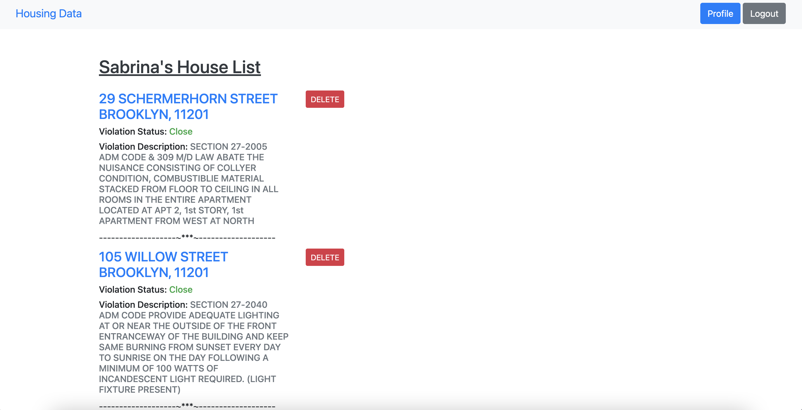
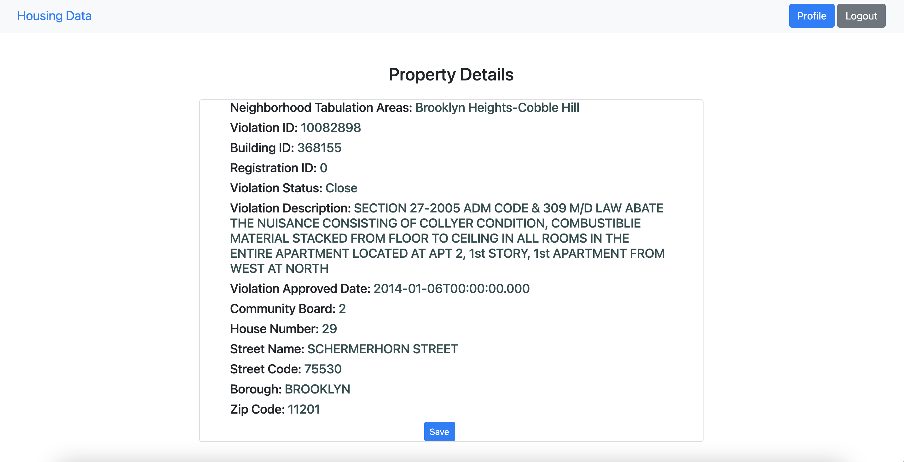

# NYC Property Violations: HousingApp


[](https://opensource.org/licenses/MIT)

## Table of Contents
- [User Story](#User-Story)
- [Demo-Screenshots of the App](#Demo-Screenshots-of-the-App)
- [Deployed Application URL](#Deployed-Application-URL)
- [Description](#Description)
- [Installation](#Installation)
- [Usage](#Usage)
- [Navigating the Repository](#Navigating-the-Repository)
- [Technologies Used](#Technologies-Used)


## User Story

```
AS a homeowner/investor/realtor 
WHEN I use NYC Property Violations: HousingApp
I WANT to be able to look up NYC property information about a home's record on housing violations I have received or that I am interested in buying. 
```


### Demo-Screenshots of the App








### Deployed Application URL

[NYC Property Violations: HousingApp](https://property-violations-housingapp.herokuapp.com/)


## Description
The homepage of the app has a search bar that lets you search a property by an address or a zip code. At the top, the navbar has a login button on the right and a clickable Housing Data link on the left, which allows the user to return to the homepage at any moment of the time. A user is free to search without logging in, but won't be able to save or get much details without haveing a profile. On the logging page the user either can signup to create an account or simply signin if he/she already has an account. Once the user is signed in, he/she can access the profile associated with that account. The profile will contatin any previously saved property. The user can always add new properties to his/her profile, delete exisiting one(s) / can click on the link(s) to check the details, or even leave using the logout button on the right side.

If the user wants to search new properties, he/she can navigate to the homepage, using the Housing Data Link. If the user searches by a zip, 10 search results will appear on the page. Note same address can appear more than once due to having multiple violations or different violation descriptions within the same violation. Other than the address and violation status, user can't see further detials until he/she saves the property. Once the user saves a property it will be added to his/her profile, and the address will appear as a clickable link. The violation status and violation description are also available with each address, and by clicking on each link the user has the ability to check futher property details. 

Simialry a user can search a property by an address but it will directly take him/her to the property details page. To save the property on the profile, he/she has to click the save button at the bottom. Once saved, the user can find the property on his/her profile with other saved properties. 


## Installation

Given you already have Node.js and MySQL Workbench installed on your computer, clone the repository on your local machine. On your local repository, create a .env file that contains 

```
DB_NAME=property_violationDB
DB_USER="YourInfo"
DB_PASSWORD="YourPassword"
```
Then open the terminal and naviagte to your local repo. Run this command to install all the dependencies. 

```
npm i 
```

## Usage

Next open MySQL Workbench and run these lines of code 
```
DROP DATABASE IF EXISTS property_violationDB;
CREATE DATABASE property_violationDB;
```
Lastly go back to the terminal and run any one of these commands to start the server. 
```
npm run start
npm start
node server.js
```

Now you can type the following line on your browser and you would be able to use the app locally. 
```
localhost:3001
```


## Navigating the Repository

Once you open the repository, you will find

* server.js 
* package.json
* package-lock.json
* README.md
* ProjectGuide.md
* .gitignore

and various folders that contain 

- assets
  - images (app screenshots)
- config 
  - connection.js
- controller
  - api
    - houseRoutes.js
    - index.js
    - userRoutes.js
  - homeRoutes.js
  - index.js
  - profileRoutes.js
- db
  - schema.sql
- models
  - House.js
  - index.js
  - User.js
- public
  - css
    - main.css
  - js
    - homeScripts.js
    - login.js
    - logout.js
    - profile.js
    - save.js
- seeds
  - houseData.json
  - seed.js
  - userData.json 
- utils 
  - auth.js
  - helpers.js
- views
  - layouts
    - main.handlebars
  - homepage.handlebars
  - house.handlebars
  - login.handlebars
  - profile.handlebars
  - zip.handlebars


## Technologies Used

- Bootstrap 
- Sequelize 
- Express
- Node
- Handlebars 
- Axios 
- Express-sessions 
- dotenv
- MySQL
- MySQL Workbench 
- Bcrypt 
- Heroku
- <a href="https://data.cityofnewyork.us/resource/wvxf-dwi5.json">NYC Open Data API</a>


Copyright (c) [2021] [Justin Ng, Sabrina Sharmin]